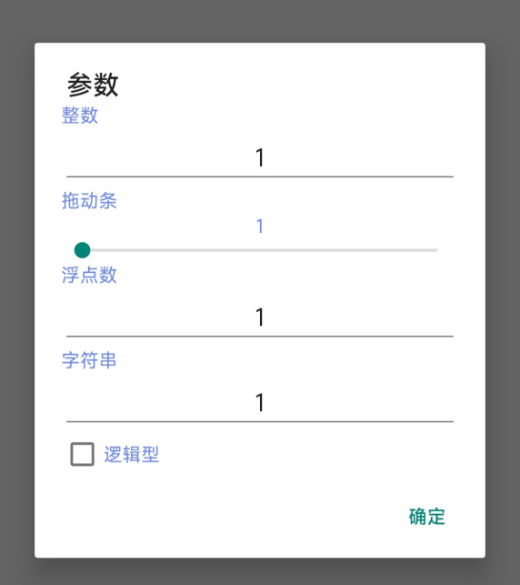

# 对话框操作（简单模式）

## ling.alert()：显示提示对话框
> void ling.alert(String message)  
> void ling.alert(String message,Boolean isClose)

- message：对话框中显示的文本
- isClose：用户是否可以通过单击空白处关闭对话框，默认为true，当此参数为false时，用户将只能通过点击对话框的按钮来关闭。

此API在构建出的对话框被关闭之前<u>**不会**</u>返回。

## ling.prompt()：显示一个输入对话框
> [Integer,Number,Boolean,String] ling.prompt(table name,table default,table type)

此API需要三个table作为参数，其中，第一个table表示当前输入条目的名称。第二个table表示当前输入条目的默认值，第三个table表示当前输入条目的类型。

!> 类型应该是以下四个值中的一个！  
ling.TYPE_INT  
ling.TYPE_NUMBER  
ling.TYPE_STRING  
ling.TYPE_CHECKOUT  

例如
~~~ lua
a1, a2, a3, a4, a5 = ling.prompt({"整数","拖动条[1;10]","浮点数","字符串","逻辑型"},{1,1,1,"1",true},{ling.TYPE_INT,ling.TYPE_INT,ling.TYPE_NUMBER,ling.TYPE_STRING,ling.TYPE_CHECKOUT})
~~~
将显示一个类似如下样式的对话框：  
  
在以上示例中，a1的值将等于对话框中“整数”一栏用户输入的值。  
a2将等于对话框中"拖动条"条目中的值  
**以此类推**

!> 要想零点显示拖动条，那么对应条目的名称中必须以[min;max]结尾，其中min是拖动条的最小值，max是拖动条的最大值。且条目的类型必须是*ling.TYPE_INT*，如果类型不是*ling.TYPE_INT*，那么零点将忽略拖动条声明！
